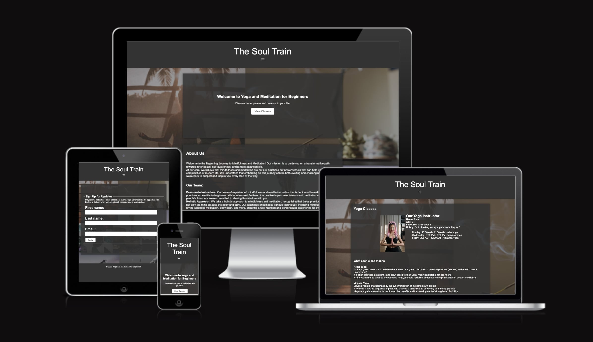
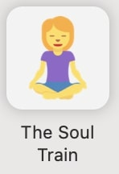
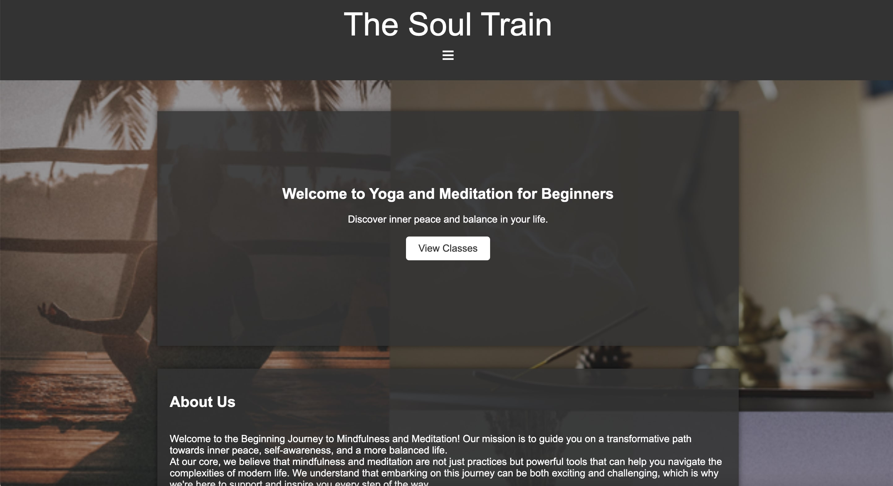
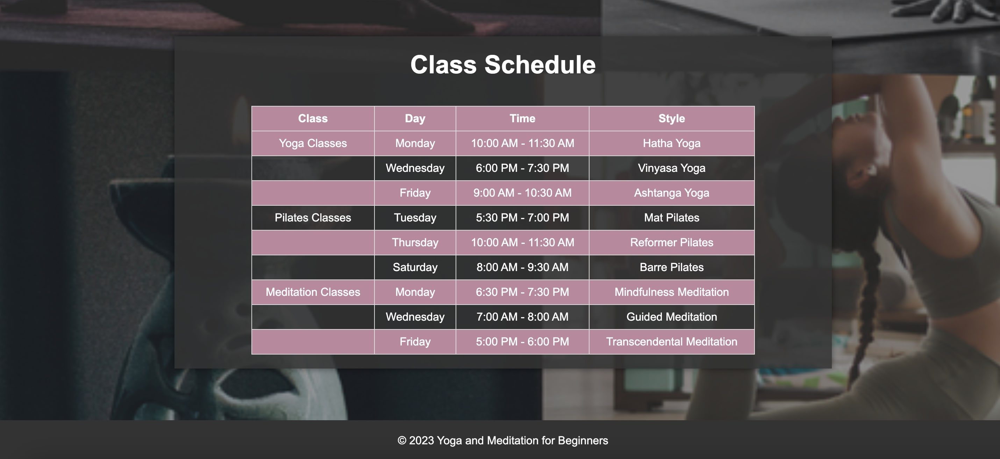
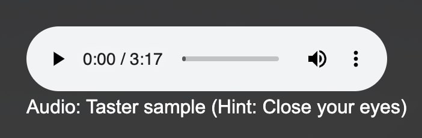
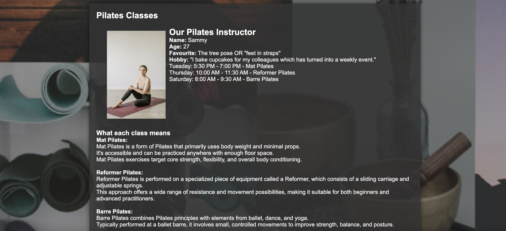
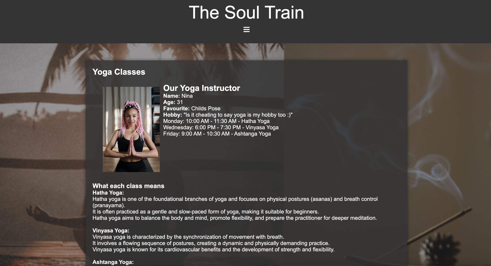
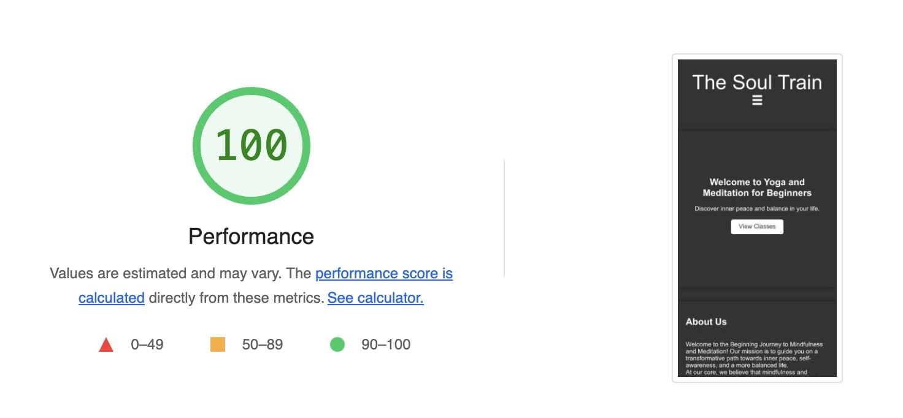
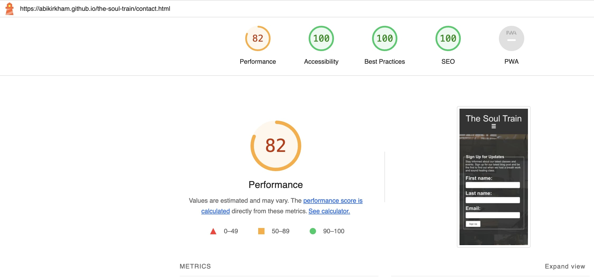

# The Soul Train: Navigating Life with Mindfulness and Meditation :lotus_position_woman:

## Contents
- [My vision](#my-vision)
- [User Stories](#user-stories)
- [Features](#features)
- [Testing](#testing)
- [Deployment](#deployment)
- [Credits](#credits)

## My Vision

Welcome to **The Soul Train**, I started Soul Train to help people like me who just got into yoga, pilates, and mindfulness. I share all kinds of info – different yoga and pilates styles, meditation tips, and even cool things like sound healing. I created this site to showcase what I can do for businesses in the yoga industry, offering ideas and resources to support growth and success. This is important to me, and I'm thrilled to share my insights in a creative and meaningful way.

### Live Site

[Explore The Soul Train](https://abikirkham.github.io/the-soul-train/index.html)

### Repository

[The Soul Train repository viewed on GitHub](https://github.com/abikirkham/the-soul-train.git)

## Technologies Used

- **HTML/CSS:** Frontend styling and structure.
- **GitHub/Gitpod:** Version control and collaboration.

# User Stories

### Beginner Yogi

1. **View Class Schedules:**
   - As a beginner yogi, I want to easily access the class schedules on The Soul Train, so I can plan my yoga sessions accordingly.

2. **Class Information:**
   - As a beginner yogi, I want detailed information on what to expect in each class, including the type of yoga and the focus of the session.

3. **Contact Page:**
   - As a beginner yogi, I want an easy-to-navigate contact page where I can ask questions about the classes or seek guidance from experienced professionals.

### Yoga Professional

4. **Join The Soul Train Team:**
   - As a yoga professional, I want to find information on how to sign up and join The Soul Train team as an instructor.

5. **Explore Class Schedules:**
   - As a yoga professional, I want to explore the class schedules and understand the class structure to align with my expertise.

6. **Contact The Soul Train Team:**
   - As a yoga professional, I want a straightforward contact page to connect with The Soul Train team for any inquiries or to express interest in joining as an instructor.

### Sound Healing Enthusiast

7. **Access Audio Section:**
   - As a user interested in sound healing, I want to access an audio section dedicated to sound healing, where I can find guided sessions or ambient sounds to enhance my yoga experience.

8. **Usage Instructions:**
   - As a user interested in sound healing, I want clear instructions on how to use the audio section and integrate it into my yoga practice.

### Equipment Guidelines

9. **Information on Equipment:**
   - As a participant, beginner, or professional, I want to have access to an information page that guides me on what equipment to bring for each class.

10. **Understanding Equipment Importance:**
    - As a participant, beginner, or professional, I want to understand the importance of specific equipment and how it contributes to the overall yoga experience.

### Reconnecting with Yoga

11. **Inclusive Platform:**
    - As a user looking to reconnect with yoga, I want a platform that caters to both beginners and professionals, allowing me to start my yoga journey or deepen my practice.

12. **User-Friendly Interface:**
    - As a user looking to reconnect with yoga, I want a user-friendly interface that provides a seamless experience, making it easy to explore classes, schedules, and additional resources.

# Features

### Favicon
[The Favicon](https://favicon.io) which is an emoji to associate my website to the content to give this an idetity, as seen below.

### Home Page
Your digital doorway featuring engaging visuals, concise descriptions, and inspirational quotes. The home page aims to pique curiosity and inspire a deeper exploration.

### About Page :dizzy:

Explore the heart of my mission, offering resources like sound healing audio and yoga essentials for an enhanced mindfulness journey.

### Class Schedule Page :calendar:
Access an updated schedule of yoga, pilates, and meditation classes for active participation and seamless integration into daily routines.

### Blog Page
Insightful blogs on mindful eating and crystals provide knowledge and skills to enhance your mindfulness journey.

### Contact Page
Establish a direct line of communication for personalized guidance, fostering a sense of belonging and support.

# Intricate Features

### Navigation Bar
Consistent across all pages, ensuring smooth and intuitive navigation for a seamless user experience. Creating a smooth interaction which can be seen easy on the eyes ... *almost peaceful.*

### Landing Page
A captivating point of entry with visually appealing, simplistic classe timetables, introducing the mission of *The Soul Train*. Creating easy access for those who have accessed the page previosuly and wanted to jump straight to the classes.

### Audio
I have added an audio section to the yoga website, offering soothing sound healing sessions, allowing you to experience the calming effects and providing a convenient option for practicing at home.

### Club Ethos
Outlining the benefits of joining yoga, pilates and medication for beginners, encouraging peacefullness to the soul, joinginh the training journey.

### Meetup Times
Crucial and real-time information about the schedules, introductions, and defintions for what each class means.

### Footer
Strategically positioned footer, reminding this is for beginners.

# Wireframes

# Testing

## Responsiveness

The Soul Train website was tested for responsiveness on screen sizes from 320px and above, following WCAG 2.1 Reflow criteria for responsive design. The testing was performed on Chrome, Edge, and Opera browsers.

### Testing Steps

1. Open the browser and navigate to The Soul Train.
2. Access developer tools (right-click and inspect).
3. Set the view to responsive and reduce the width to 320px.
4. Zoom out to 50%.
5. Click and drag the responsive window to maximum width.

### Expected Results

The website should be responsive on all screen sizes with no pixelated or stretched images, no horizontal scrolling, and no overlapping elements.

### Actual Results

The website behaved as expected.

## Accessibility

Utilise the Wave Accessibility tool for ongoing development and final testing. Concentrate on the following criteria:

1. Ensure all forms have associated labels or appropriate aria-labels.
2. Validate that color contrasts meet the minimum ratios outlined in WCAG 2.1 Contrast Guidelines.
3. Verify correct heading levels to accurately convey content importance.
4. Confirm content is organized within landmarks for ease of use with assistive technology.
5. Provide alternative text or titles for non-textual content.
6. Set the HTML page lang attribute.
7. Implement Aria properties in adherence to best practices outlined in WCAG 2.1.
8. Follow established coding best practices for WCAG 2.1.

## Manual Tests

### Lighthouse Testing
- Integrated into Chrome Developer Tools or available as a standalone tool.
- I improved my website's loading speed by downloading the background image to my local assets and updating the CSS link from an HTTPS URL to the local path, as seen below this imporved the lighthouse score.
  
  

- Below you can see the Lighthouse results for all pages
  
  
  
  
  
      
## Functional Testing

### Navigation Links

Navigation links on the respective pages were tested for correctness, ensuring they directed users to the intended pages.

- Home links to index.html.
- About links to about.html.
- Classes links to classed.html.
- The sign up page links to contact.html.
- All blogs can be seen under blogs.html with hidden htmls under the 'Read More' section for the 5 different blogs.
- Redirection from thank you page goes to 'index.html'.

All links navigated to the correct pages as expected.

## Form Testing

The site was tested for both correct and incorrect inputs, covering various scenarios.

### Scenario One - Correct Inputs

The sign up form submits successfully with no errors, redirecting to index.html.

### Scenario Two - ALTs for images, audio and background

Following the correct structure provided by the LoveRunning Project inout media by code institute but appyling it to my soundheaing section- ensureing i was following the right path and covering all bases, ensuring it worked by running this through on different browsers and passing through the W3C validator ensuring there were no errors. Also testing on different browsers and devices to ensure this pulled through on all.

## Unfixed Errors

**Issue #1:** With the support and guidance with the communities on slack and from tutors at code institute providing my with all information on how to adjust the images on multi sized screens to fit in the containers. However, on smaller screens these images do present stretched.
 

**Issue #2:** Hidden checkboxes and labels for the gallery filter and accordion were inaccessible via keyboard due to the use of `display: none;`. Used for the navigation, including the icons, such as, ☰, which I found from Microsoft word keyboard.

# Validator Testing

## HTML

No errors were found when using the official W3C validator for HTML.
 

## CSS

No errors were found when using the official (Jigsaw) validator for CSS.
 

## Deployment

### Github

This project, *The Soul Train*, is deployed using GitHub pages using the following process,

### Deploying a GitHub Repository via GitHub Pages

- In your Repository section, select the Repository you wish to deploy.
- In the top horizontal Menu, locate and click the Settings link.
- Inside the Setting page, around halfway down locate the GitHub Pages Section.
- Under Source, select the None tab and change it to Main and click Save.
- Finally once the page resets scroll back down to the GitHub Pages Section to see the following message "Your site is ready to be published at (Link to the GitHub Page Web Address)". It can take time for the link to open your project initially, so please don't be worried if it does not load immediately.

### Making a Local Clone

- Find the GitHub Repository.
- Click the Code button
- Copy the link shown.
- In Gitpod, change the directory to the location you would like the cloned directory to be located.
- Type git clone, and paste the link you copied in step 3.
- Press Enter to have the local clone created.

# Credits

## Coding instructions
* Inspiration from Love Running project provided by Code Institute
* https://developer.mozilla.org/en-US/docs/Web/CSS/:hover# for hover effect
* https://www.w3schools.com/css/css_background_image.asp for image as a background image
* https://www.youtube.com/watch?v=iXKScihfSwE for navigation bar
* w3schools to remind me throughout on the proper structure/ written code
* Signup form and redirection page from mentor Gareth McGirr Tacos Travels
* Flexbox:
    * Daisy McGirr
* README image sizes - https://gist.github.com/uupaa/f77d2bcf4dc7a294d109

## Media
Photos taken from https://www.freeimages.com
To create the styles of the background using the images, I used this https://www.sketchbook.com
Audio taken from https://stock.adobe.com/uk/search/audio?k=356526657 
